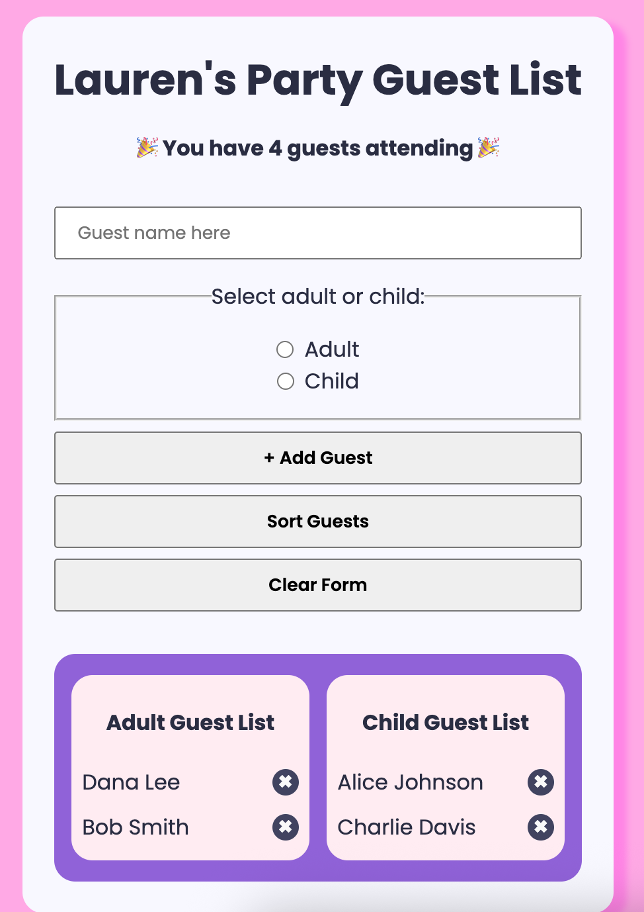

# Party Planning App - A twist on the classic todo app



<h2 align="center">Web application to create a guest lists and assist with party planning.</h2> 

[Live Site](https://party-planner-dh6c.onrender.com/)

## 🚀 Features
- Adding Guests
- Deleting Guests
- Sorting Guests
- Clearing form
<br/>


## Getting Started

This project was built using React v 19 It is a web application and for running on your local environment you should follow these guidelines.


### Prerequisites

- NPM 

### Setup


The project repository can be found in [GitHub link](https://github.com/LaurenAMolloy/party-planner) or just clone the project using this command. 


```
Using HTTPS

# git clone  https://github.com/LaurenAMolloy/party-planner.git
```

+ Open terminal on your workspace with

```
cd /home/workspace/React-Weather-App
```

## Install

Install NPM

Check that you have node and npm installed

To check if you have Node.js installed, run this command in your terminal:

```
node -v
```

To confirm that you have npm installed you can run this command in your terminal:

```
npm -v
```

To install all the dependences of the project, run the following command:

```
npm install
```

To run the application, run the following command:

```
npm run dev
```

### Tools used on this project

- Visual Studio Code
- Vite Js React Template

<br/>
